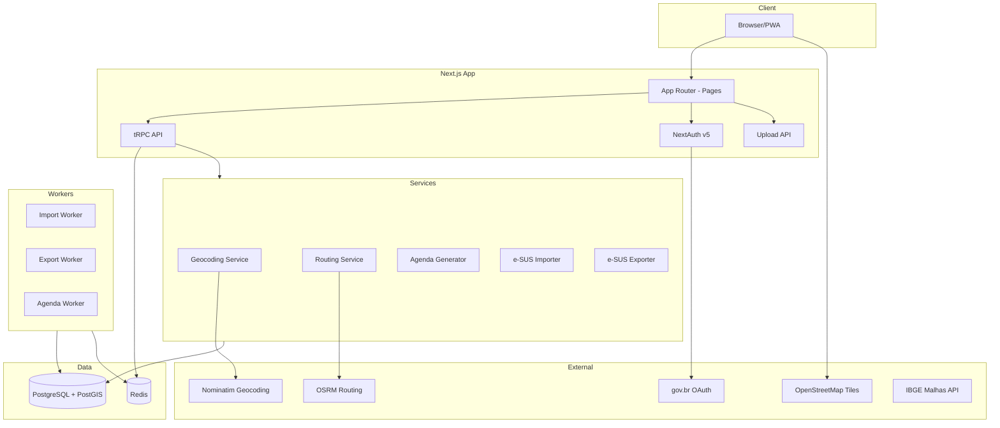

# Arquitetura — SaudeTerritorio

## Visao Geral

## Decisoes Tecnicas

- **Next.js 14 App Router**: SSR + RSC para SEO e performance
- **tRPC v11**: Type-safety end-to-end entre client e server
- **Prisma + PostGIS**: ORM com suporte a geometrias via raw queries
- **BullMQ + Redis**: Filas para processamento assincrono de imports/exports
- **MapLibre GL JS**: Mapa open-source sem custos de licenca
- **Multi-tenant logico**: Campo `prefeituraId` em todas as entidades

## Modulos

| Modulo     | Responsabilidade                            |
| ---------- | ------------------------------------------- |
| Auth       | Login credentials + gov.br OAuth + RBAC     |
| Territorio | Gestao de microareas com validacao PNAB     |
| Domicilios | CRUD de domicilios e moradores              |
| Visitas    | Registro de visitas com check-in GPS        |
| Agenda     | Geracao automatica de roteiros diarios      |
| Importacao | Import e-SUS APS (CSV, XML, ZIP)            |
| Exportacao | Export e-SUS APS (CSV, XML, ZIP)            |
| Dashboard  | Painel de gestao com mapa e KPIs            |
| Relatorios | Cobertura, produtividade, visitas atrasadas |
